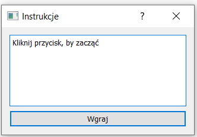

# Generowanie instrukcji PDF

### Zasady działania

**Ogólne zasady:** Program generuje dokument `PDF` z arkusza tekstowego `Word` zawierającego instrukcje obsługi i strony tytułowej z dokumentu `PDF`

### Przed uruchomieniem

**Należy się upewnić, by w folderze, w którym uruchamiamy program, znajdywały się wymagane pliki** 

1. Plik ze stroną tytułową powinien nosić nazwę `start.pdf`
2. Nie może być więcej niż jeden plik z arkuszem tekstowym `Word`
3. Finalny dokument `PDF` będzie nosić nazwę taką jak plik `Word`

### Zdjęcia:

1. Główne okno programu:

 
